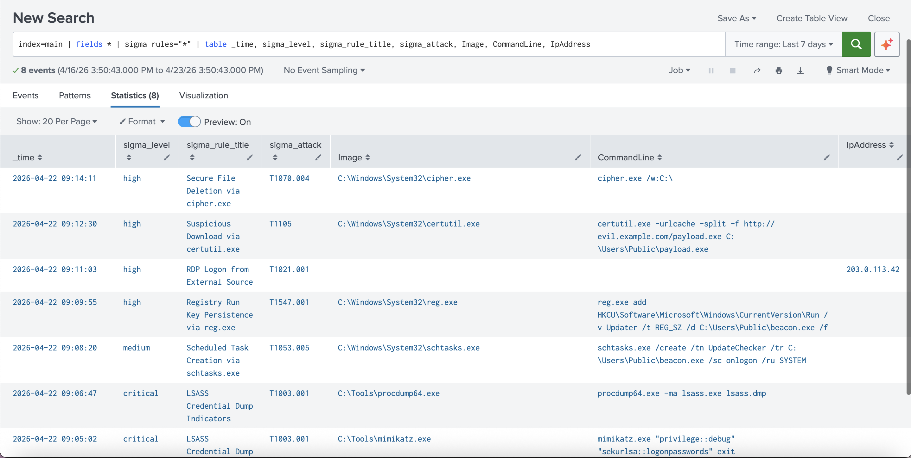

# splunk-sigma

[](https://github.com/JacobRHess/splunk-sigma/actions/workflows/ci.yml)
[](app/LICENSE)
[](pyproject.toml)

**Run [Sigma](https://github.com/SigmaHQ/sigma) detection rules natively inside Splunk** via a custom `| sigma` search command. Bundled content maps to [MITRE ATT&CK](https://attack.mitre.org/) and ships with a coverage dashboard.

```
index=sysmon EventCode=1 | sigma rules="attack:T1059.001"
```



---

## Why this exists

Splunk shops want Sigma — vendor-neutral, shareable detections — but the standard path (convert Sigma → static SPL) produces fragile search strings that drift from the upstream rules. `splunk-sigma` takes the other path: it runs the Sigma rule evaluator **inside Splunk** as a streaming command. One rule file, always in sync.

## Features

- **`| sigma` streaming search command** — evaluates Sigma YAML rules against any piped events
- **7 bundled rules** mapped to MITRE ATT&CK (credential access, persistence, lateral movement, LOLBins, defense evasion)
- **ATT&CK coverage dashboard** showing alerts per technique / severity
- **Pre-wired saved searches** for common Sysmon / Security log sources
- **Zero external runtime deps** beyond what ships with Splunk
- **GitHub Actions CI** — lints rules, runs the evaluator test suite, builds the app tarball

## Architecture

```
┌─────────────────┐     ┌──────────────────┐     ┌────────────────┐
│ Splunk search   │     │  | sigma command │     │ Enriched events│
│ (any index)     │ ──▶ │  (StreamingCmd)  │ ──▶ │ back to SPL    │
└─────────────────┘     └──────────────────┘     └────────────────┘
                                │
                                ▼
                        ┌──────────────────┐
                        │  Sigma engine    │  (bundled in app/bin/)
                        │  rules + eval    │
                        └──────────────────┘
```

## Quickstart (no Splunk needed)

The engine runs standalone — useful for CI, demos, and testing rules without spinning up Splunk.

```bash
git clone https://github.com/<you>/splunk-sigma
cd splunk-sigma
pip install .[dev]
python3 scripts/demo.py samples/attack_samples.jsonl
```

Sample output:

```
Loaded 7 rule(s). Scanned 11 event(s).

[HIGH] PowerShell Encoded Command Execution
  rule: t1059_001_pwsh_encoded    ATT&CK: T1059.001
  time: 2026-04-22T14:03:11Z      user: CORP\alice
  evidence: powershell.exe -nop -w hidden -enc JABzAD0ATgBlAHcALQBPAGIAagBlAGMAdAA=

[CRITICAL] LSASS Credential Dump Indicators
  rule: t1003_001_lsass_dump      ATT&CK: T1003.001
  time: 2026-04-22T14:05:02Z      user: CORP\attacker
  evidence: mimikatz.exe "privilege::debug" "sekurlsa::logonpasswords" exit

[HIGH] RDP Logon from External Source
  rule: t1021_001_rdp_external    ATT&CK: T1021.001
  time: 2026-04-22T14:11:03Z      user: alice
  evidence: 203.0.113.42

...

8 alert(s) across 7 rule(s).
```

Run tests:
```bash
PYTHONPATH=app/bin pytest -v
```

## Install into Splunk Enterprise

See [`docs/SPLUNK_INSTALL.md`](docs/SPLUNK_INSTALL.md) for the full step-by-step install guide, including account creation, sample-data loading, and screenshots to capture.

Short version:
```bash
export SPLUNK_HOME=/Applications/Splunk
bash scripts/install_local.sh
$SPLUNK_HOME/bin/splunk restart
$SPLUNK_HOME/bin/splunk add oneshot samples/attack_samples.jsonl -sourcetype _json -index main
# Then in Splunk Web:  index=main | sigma rules="*"
```

## Two modes: in-Splunk command vs. external service

`splunk-sigma` runs Sigma rules two ways, sharing the same rule files and evaluator:

| Mode | How it runs | Good for |
|---|---|---|
| **`\| sigma`** | Inside Splunk as a StreamingCommand | Interactive SPL, dashboards, ad-hoc triage |
| **`sigma_watch`** | External Python service, calls Splunk's REST API | Always-on detection service, multi-instance monitoring, CI |

```bash
# Mode 2 — run detections externally against Splunk's REST API (port 8089)
export SPLUNK_USERNAME=admin SPLUNK_PASSWORD='<pw>'
python3 scripts/sigma_watch.py --once
python3 scripts/sigma_watch.py --interval 60 --output-index sigma_alerts

# Or run the full closed-loop demo (clears prior alerts, writes new ones,
# verifies they landed via SPL — good for live walkthroughs):
bash scripts/demo_api.sh
```

See [`docs/API_MODE.md`](docs/API_MODE.md) for the full API-mode guide.

## Bundled detections

| Rule | ATT&CK | Severity |
|------|--------|----------|
| PowerShell Encoded Command Execution | T1059.001 | high |
| LSASS Credential Dump Indicators | T1003.001 | critical |
| Scheduled Task Creation via schtasks.exe | T1053.005 | medium |
| Registry Run Key Persistence via reg.exe | T1547.001 | high |
| RDP Logon from External Source | T1021.001 | high |
| Suspicious Download via certutil.exe | T1105 | high |
| Secure File Deletion via cipher.exe | T1070.004 | high |

## Command reference

```
| sigma [rules=<selector>] [rules_dir=<path>]
```

- `rules` — selector. Examples:
  - `"*"` (default) — all loaded rules
  - `"attack:T1059.001"` — rules tagged with a specific ATT&CK technique
  - `"id:t1053*"` — rule ID glob
- `rules_dir` — override the bundled rules directory (absolute path)

Each matching event is emitted with additional fields:
`sigma_rule_id`, `sigma_rule_title`, `sigma_level`, `sigma_attack`, `sigma_matched_selections`.

## Supported Sigma features (v1)

- Multiple selections, `and` / `or` / `not`, parentheses
- `1 of selection_*`, `all of selection_*` quantifiers
- Modifiers: `contains`, `startswith`, `endswith`, `re`
- Field list values (OR semantics)

**Not supported in v1**: aggregations (`count()`), correlations across events, timeframes.

## Repo layout

```
splunk-sigma/
├── app/                     Splunk app (what gets packaged)
│   ├── default/             app.conf, commands.conf, dashboards, saved searches
│   ├── bin/
│   │   ├── sigma_command.py   StreamingCommand entrypoint
│   │   ├── sigma_engine/      rule loader + evaluator
│   │   └── rules/             bundled Sigma YAML
│   └── metadata/
├── samples/                 attack log fixtures
├── scripts/                 install_local.sh, package.sh
├── tests/                   pytest suite
└── .github/workflows/ci.yml
```

## License

MIT — see [`app/LICENSE`](app/LICENSE).
